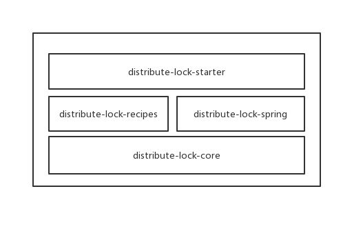

# 介绍

一个非常好用的分布式锁项目，支持ZK和Redis分布式锁实现，可以使用注解和代码的方式获取分布式锁，保证资源的互斥访问。

支持功能：
- Redis分布式锁实现
- ZK分布式锁实现
- 自定义实现
- 一键开关分布式锁功能
- 支持Spring
- 支持SpringBoot

# 背景

在分布式项目中，有时需要使用分布式锁对资源进行唯一的访问，项目中常用的实现方案如Redis和ZK，如果直接使用，对项目侵入性大，
如果换种实现则需要付出较大的代价。

既然如此，就需要一个可以迅速切换的无侵入或改造成本低的分布式锁实现方案，而且可以一键关闭，DistributeLock就这样孕育而生了。

# 如何使用

由于此项目还未发布到maven仓库，需要将代码pull后导入自己的maven库。

第一步：引入pom

~~~
       <dependency>
                <groupId>com.cml.component</groupId>
                <artifactId>distribute-lock-starter</artifactId>
                <version>${lastVersion}</version>
            </dependency>
~~~

第二步：配置分布式锁的实现方案

- redis实现
    ~~~
        distribute:
          lock:
            enable: true
            type: redis
            redis:
              enable: true
              timeout: 1000 #redis连接超时时间
              retryCount: 1 # 失败重试次数
              retryInterval: 1000 # 失败重试间隔时间
              masterName: #redis配置为主从时配置
              password:
              nodes:
                - "redis://192.168.99.100:6379" 
              type: single # 可选single，sentinel，master-slave
    ~~~
    
- ZK实现
    ~~~
    distribute:
      lock:
        enable: true
        type: zk
        zk:
          connTimeout: 15000
          retryCount: 2
          retryInterval: 500
          connectUrl: "192.168.99.100:2181"
    ~~~
- 自定义实现
    ~~~
    distribute:
      lock:
        enable: true
        type: custom
        
     自定义只需继承AbstractDefaultDistributeLockService即可，可参考：RedisDistributeLockService实现
    ~~~

第三步：在需要分布式锁的方法上添加注解：
~~~
    @DistributeLock(category = "lockService", key = "#arg0")
~~~
注解说明：

- category: 锁的分类，通过不同的分类可以最大程度上避免了锁重复的问题
- key： 分布式锁key，支持从方法参数中获取
 
 第四步（可选）：监听锁的获取与释放
 ~~~
    只需要实现接口：DistributeLockListener 即可，详见distribute-lock-sample中的单元测试
 ~~~
 
 # 项目依赖关系
 
 
 
 # 意见与建议
 
 如果使用过程中有任何的意见和建议，欢迎添加issue！！！